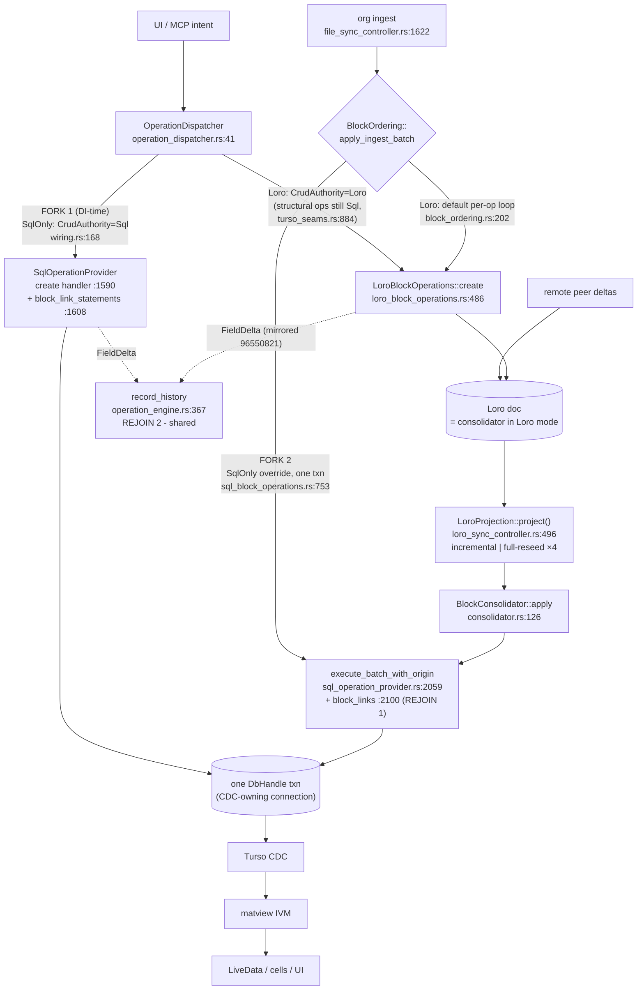

# Write-Path Unification — Options for Ruling (2026-07-17)

**Status: options document for Martin's ruling. No code changes proposed here.**

Question: WHY do SqlOnly and with-Loro wiring have divergent code paths through
the block-write stack, and can they be unified to shrink the bug surface?

Grounding: code read from the current integration tree; every claim carries a
file:line citation. Prior rulings incorporated (not relitigated): the SqlOnly
axis is **permanent product config** (2026-07-07 reframe: modularity forcing
function + the coherent config for SyncThing/Drive users + the fast path,
18–93ms vs 4.2–6.3s); text merge is **already unified** via
`TransientLoroTextMerge` (`crates/holon-loro/src/text_merge_provider.rs:123`,
wired unconditionally at `crates/holon-app/src/wiring.rs:238-241`); the `Lww*`
cell-backing family **stays** (it is a write path, not a merge impl — closed
2026-07-07). This document is therefore about the remaining divergence: the
**op-application layer**, not merge and not cell backings.

---

## 1. Why now — four asymmetry bugs in one night (2026-07-16/17)

All four are instances of one class: *every block-op feature must be
implemented twice (SqlOperationProvider vs LoroBlockOperations; batch sink vs
single-op path), and the keystone's full_headless wiring exercises one side per
run, so asymmetries ship silently.* All four were fixed tonight — each by
**manually mirroring** one side onto the other, i.e. by paying the class's tax
again, not by removing the class.

| # | Bug (BugFunnel entry) | Asymmetry | Fix (tonight) |
|---|---|---|---|
| 1 | block_links junction empty in default wiring (row-33, `docs/Testing/BugFunnel.md`) | `block_link_statements` wired into single-op create/update/set_field paths (`crates/holon/src/core/sql_operation_provider.rs:1608-1622`) but NOT into `execute_batch_with_origin` — the Loro→SQL projection sink | mirrored into the batch path (`sql_operation_provider.rs:2100-2117`, commit `7f7c17d101bb`) |
| 2 | `dismiss_advice` undispatchable in prod GPUI session (BugFunnel.md:28) | implemented ONLY on `LoroBlockOperations` (`crates/holon-loro/src/loro_block_operations.rs:133-162`); `SqlOperationProvider` never advertised it; desktop defaults to SqlOnly (`wiring.rs:168`) → "No provider registered for entity: 'block'" | mirrored: SqlOperationProvider now advertises + handles it (`sql_operation_provider.rs:1256-1277`, `2006`; integration `0e005fd1`) |
| 3 | O(N²) boot-ingest (row-32) | `BlockOrdering::apply_ingest_batch` SqlOnly override batches a file into ONE transaction (`crates/holon/src/core/sql_block_operations.rs:753-830`); Loro mode keeps the trait-default per-op loop (`crates/holon-core/src/block_ordering.rs:202-213`) — the fix structurally cannot help Loro wiring | fixed for SqlOnly only; Loro fallback documented |
| 4 | Loro creates recorded zero history op_groups (C2) | SQL create emits `FieldDelta(id, "id", Null, id)` (`sql_operation_provider.rs:1710`); Loro create returned empty `changes` → the shared `record_history` chokepoint (`crates/holon/src/api/operation_engine.rs:367-382`) recorded nothing | mirrored: Loro create now emits the identical synthetic delta (`loro_block_operations.rs:632-638`, commit `96550821`) |

The pattern to rule on: symmetry is currently maintained **by convention and
vigilance**, at N call sites, verified by nothing structural.

---

## 2. Current write topology (block create with `[[link]]` marks)

### 2.1 Hop-by-hop

**SqlOnly mode** (desktop default, `loro:false` at `wiring.rs:123/168`):

1. Entry: UI keystroke / MCP `create_block` / org ingest.
2. `OperationDispatcher` (`crates/holon/src/api/operation_dispatcher.rs:41`)
   routes `(entity, op)` against each provider's advertised
   `operations()` list; unadvertised op → loud error (`:657`).
3. `SqlOperationProvider::execute_operation` → `"create"` handler
   (`sql_operation_provider.rs:1590-1758`): builds row SQL, derives
   `block_links` from `marks` (`block_link_statements`, `:919-963`, calling
   `holon_api::derive_block_links`), executes rows+edges in **one**
   `DbHandle` transaction (`:1637`).
4. History: returns `FieldDelta(id)` → shared
   `DispatchingOperationEngine::record_history`
   (`operation_engine.rs:367-382`, call sites `:603`, `:904`).
5. Org ingest bypasses 2–3: `file_sync_controller.rs:1622-1651` →
   `BlockOrdering::apply_ingest_batch` → SqlOnly override
   (`sql_block_operations.rs:753-830`) → whole file as one
   `execute_batch_with_origin(…, EventOrigin::Org)` transaction (`:823-824`).
6. Transaction commit → Turso CDC (all writes via the single `DbHandle` actor
   that owns the CDC-registered connection, `sql_operation_provider.rs:235-236`)
   → matview IVM (`crates/holon-turso/src/matview_manager.rs`) → LiveData/UI.

**Loro mode** (`loro:true`; the CRDT config):

1. Same entry, same dispatcher.
2. DI fork: `wiring.rs:167-201` registers `LoroBlockOperations` as
   `CrudAuthority`; `crates/holon-app/src/turso_seams.rs:884-900` wraps it into
   the provider set. **Structural ops (indent/split/move) are still served by
   `SqlBlockOperations` via registration-order win** — even Loro mode is a
   hybrid; only create/set_field/delete go to Loro.
3. `LoroBlockOperations::create` (`loro_block_operations.rs:486-654`): mutates
   the Loro tree (`loro_backend.rs:3566-3582`), persists the doc, returns the
   (since tonight) mirrored `FieldDelta(id)`.
4. Async projection: `LoroSyncController` subscribes to the doc
   (`crates/holon-loro/src/loro_sync_controller.rs:120-289`);
   `LoroProjection::project()` (`:496`) takes the O(changed) incremental path
   or falls back to **full-document reseed** on four conditions
   (`FullReason` enum `:84-104`: EmptyPendingMovedFrontier, Oversized,
   Unsettled, Orphan; plus SinkFail and ColdBoot).
5. `BlockConsolidator::apply` (`crates/holon-loro/src/consolidator.rs:126`) →
   `SqlOperationProvider::execute_batch_with_origin(…, EventOrigin::Loro)`
   (`sql_operation_provider.rs:2059-2168`): prepares row+edge SQL, derives
   `block_links` (since tonight, `:2100-2117`), one transaction. Returns
   **all-irreversible** results (`:2166`) — no per-op undo from this path.
6. Same CDC → matviews → UI from here; the pipeline is backend-blind.
7. Org ingest in Loro mode: `apply_ingest_batch` **trait default** — per-op
   loop (`block_ordering.rs:202-213`); the `SqlBlockOperations` override
   itself delegates to the loop when the consolidator is `Upstream`
   (`sql_block_operations.rs:753-764`).
8. **Remote peer deltas** import directly into the Loro doc and reach SQL only
   via steps 4–5. No local op layer, dispatcher, or provider ever sees them.

### 2.2 Diagram — where the paths fork and rejoin



Fork count: **two** (DI-time provider selection; batch-sink override). Rejoin:
everything downstream of the SQL transaction (CDC, matviews, advice weaver
`crates/holon-frontend/src/advice_weaver.rs:84-100`, history chokepoint) is
already a single mode-blind path.

---

## 3. Forced vs incidental divergence

### Forced (must differ; keep)

- **F1 — Consolidator authority.** Model.md layer 2: exactly one merger per
  vault — the Loro doc when enabled, Turso-LWW in SqlOnly. Mutating a tree
  CRDT (move semantics, Peritext marks, frontiers) is genuinely different code
  from emitting SQL. This is the axis itself; the 2026-07-07 ruling keeps it.
- **F2 — Remote-op ingress (load-bearing constraint).** Peer deltas enter via
  Loro import → projection → `execute_batch_with_origin`, bypassing every
  local op layer. Therefore any invariant that must hold for **all** block
  rows (junction derivation, matview input shape) can only be enforced at the
  SQL sink. Tonight's row-33 fix landed in exactly the right place; no
  op-layer unification can substitute for it.
- **F3 — Order minting.** SqlOnly mints `gen_key_between` sort keys
  (`sql_block_operations.rs` batch path); Loro derives fractional indexes from
  the tree. Mixing keyspaces is invariant-10 territory; stays per-mode.
- **F4 — Merge.** Already unified where unification is sound
  (`TransientLoroTextMerge` for text 3-way; per-key property merge is the open
  remaining work from the 07-07 spike). Not this document's scope.

### Incidental (the accreted bug surface)

- **I1 — Two op-descriptor sets.** `operations()` implemented independently
  (`sql_operation_provider.rs:1158-1279` vs macro-generated + hand-built in
  `loro_block_operations.rs:865,915`). Drift = bug #2's class.
- **I2 — Two param-parsing/validation bodies per op.** Both providers parse
  `StorageEntity` fields by hand (`parent_id`, `content`, `id`, …).
- **I3 — Two FieldDelta emission sites** that must agree by convention — bug
  #4's class. ADR 0025's "ops are the sole propagation currency" *rests on*
  both backends emitting identical delta shapes, with nothing enforcing it.
- **I4 — Edge derivation wired per call site.** `block_link_statements` must
  be invoked from every path that writes block rows (single-op create, update,
  set_field("marks"), batch) — bug #1's class; fixed by adding the Nth call
  site, N will grow again.
- **I5 — Batching as trait-default-vs-override** — bug #3's class: the
  performant shape exists once, in one mode.
- **I6 — Routing by registration order.** Structural ops go to
  `SqlBlockOperations` in Loro mode because it registered first
  (`turso_seams.rs:636,884-900`). Implicit, undocumented in types — a latent
  I1 sibling.
- **I7 — Marks extraction only on `set_field("content")`**
  (`operation_dispatcher.rs:569-628`), not on create (BugFunnel row-34
  residual) — a symptom of op semantics living in the dispatcher rather than
  one canonical place.

**Answer to the WHY:** the divergence exists because the *mode axis* (forced,
intentional, ratified) was implemented as *two full-stack
`OperationProvider`s* rather than as two narrow strategies under one op
semantics layer. The forced part is F1–F3 — roughly "who orders/merges and how
bytes persist." Everything in I1–I7 is op semantics that is mode-invariant by
definition (an op's parameters, its edge derivations, its history footprint,
its batching shape do not depend on the consolidator) and is duplicated only
because the trait boundary was drawn at the top of the stack instead of the
middle.

---

## 4. Options

### Option A — Canonical op-application layer over a consolidator-strategy trait

**What it concretely is.** Draw the boundary where forced meets incidental.
One shared, mode-blind layer owns everything in I1–I7; below it a narrow
strategy trait owns F1/F3:

```rust
// ONE catalog: descriptors, typed parsing, deltas — parse-don't-validate
enum BlockOp { Create { parent: ParentRef, content: MarkedText, id: BlockId, .. },
               SetField { .. }, Delete { .. }, DismissAdvice { .. }, .. }
impl BlockOpCatalog {
    fn descriptors() -> Vec<OperationDescriptor>;            // kills I1
    fn parse(op: &str, params: StorageEntity) -> Result<BlockOp>; // kills I2, I7
    fn history_deltas(op: &BlockOp) -> Vec<FieldDelta>;      // kills I3
}
// ONE narrow strategy seam (replaces the dual OperationProvider for blocks)
trait ConsolidatorWrite {
    async fn apply(&self, ops: Vec<BlockOp>) -> Result<Vec<OpOutcome>>; // kills I5
}
// SqlStrategy  → execute_batch_with_origin (batch of N, or of 1)
// LoroStrategy → doc mutation in one Loro commit; SQL arrives via projection
```

The sink rule (F2) is the companion, and it is what kills I4: **all** SQL
block writes — interactive single ops included, as a batch of one — go through
`execute_batch_with_origin`, and row-level derivations (`block_links`,
page-tag resolution, future edges) live **only** there. After A, exactly one
derivation site exists and remote ops hit it too.

**Worked example — where tonight's four bugs become impossible:**
- #1 (links): only one derivation site exists (the sink); there is no
  "single-op path" to forget. Impossible by construction.
- #2 (dismiss_advice): one descriptor list serves both modes; an op cannot be
  advertised in one mode only. Impossible.
- #3 (batching): the catalog layer always hands `Vec<BlockOp>` to the
  strategy; the SqlStrategy's transaction batching and the LoroStrategy's
  single-commit batching are each written once. The per-op-loop *shape*
  cannot exist. Impossible.
- #4 (history): `history_deltas` computed once from the typed op, before the
  strategy runs. Impossible.

**Decisive tradeoff.** Largest in-scope refactor. Two real prerequisites:
(a) `execute_batch_with_origin` must return genuine per-op results instead of
`OperationResult::irreversible` (`sql_operation_provider.rs:2166`) before the
single-op path can collapse into batch-of-one — this touches undo (open
question Q1); (b) the `OperationProvider` dualism for blocks is deleted, per
the no-old-paths refactoring directive — a wide but mechanical blast radius.

**Migration (increments; de-risk first):**
0. *De-risk experiment:* extract descriptors into one shared table consumed by
   both existing providers + a parity assertion (`both providers' operations()
   == catalog`). Small, reversible, immediately kills I1.
1. Typed `BlockOp` parse at the dispatcher boundary; providers take typed ops
   (kills I2; moves marks extraction into parse → kills I7).
2. `history_deltas` into the catalog (kills I3).
3. Sink consolidation: batch path returns real per-op results; single-op path
   becomes batch-of-one; delete the single-op derivation code (kills I4).
4. Reduce both providers to `ConsolidatorWrite` strategies; explicit routing
   for structural ops (kills I5, I6). Delete the old surfaces.

**Latency.** Neutral — does not touch `LoroProjection`; explicitly does NOT
bet on the CRDT reseed workstream (which as of the 2026-07-17 re-measure shows
all four leak reasons un-observed at keystone N, only coldboot fires — but
enforce is deliberately not flipped). Side benefit: LoroStrategy applying an
ingest batch as one doc commit produces one pending change for the projection
instead of N, which *reduces* Oversized/Unsettled pressure.

### Option B — SQL-canonical: Loro as CDC-fed write-through replica

**What it concretely is.** Invert today's authority. All local writes in both
modes go through the single SQL op path (only `SqlOperationProvider` exists as
an op provider, ever); the Loro doc is maintained *downstream* from CDC as a
replica/transport artifact; inbound peer deltas import into the doc and
re-enter the system as replica intent (`diff(base, current)`) through the
consolidator's 3-way machinery — exactly like an org file does today
(Model.md layer 1).

**Worked example.** All four bugs impossible trivially — there is only one
write path in existence. Also the best interactive latency in every mode: the
CRDT leaves the hot loop entirely, and the reseed workstream becomes
irrelevant to local edits.

**Decisive tradeoff — and why it likely disqualifies itself.** It demotes Loro
from consolidator to replica. Model.md derives (not asserts) that structural
op-fidelity merge exists *only* when the Loro store holds actual history and
is the authority: "reconstructing move-ops from two tree states **is** the
hard problem itself" (Model.md, "Loro is three capabilities"). Under B, the
CDC→doc reflection must infer tree moves from row diffs, and concurrent peer
structure edits degrade to AST-3-way/LWW quality — the collaboration cluster
(delta sync, share/accept, frontiers) loses precisely the fidelity persistent
Loro exists to provide. It also collides with invariant 10 (bases/epochs are
defined against the consolidator's linear history) and would rewrite the ADR
trail. The 07-07 reframe ("Loro mounts when sync/share enabled") walked up to
this line deliberately and stopped: Loro-as-storage is *opt-in live-sync
infrastructure*, not something to hollow out.

**Migration.** The largest of all options, with an epoch-handover migration
(currently unbuilt, spec 0008 Phase 4.1) as a hard prerequisite.

**Verdict framing.** Record as the fallback if live P2P collaboration is ever
descoped; not compatible with current goals. Not recommended.

### Option C — Status quo + differential symmetry harness

**What it concretely is.** No refactor. A new PBT arm executes the same
generated op sequence against BOTH wirings and diffs the observable outputs:
(a) descriptor sets per entity, (b) resulting SQL state — block rows,
`block_links`, edge junctions, (c) history op_groups per op. Op-level, not
keystone-times-two, so it stays cheap and localizes failures to the provider
layer by construction (driver-ladder rung: provider, not UI).

**Worked example.** Would have *detected* (not prevented): #2 as a descriptor
diff on day one; #1 as a `block_links` diff on the first generated
create-with-marks through Loro wiring; #4 as an op_group count diff. #3 is a
latency/pass-count asymmetry, not a state diff — needs the
matview-passes-per-file oracle generalized (the regression tests
`batched_ingest_runs_matview_maintenance_once_per_file` /
`per_op_ingest_runs_one_matview_pass_per_block` in `sql_block_operations.rs`
are the template); partial coverage at best.

**Decisive tradeoff.** Cheapest now, zero regression risk — and it
institutionalizes the two-impl world: every feature is still written twice,
forever, with a faster alarm bell. It is also net-negative against the
north-star (ONE env-selected PBT; slices are scaffolding to delete): it *adds*
a permanent comparison harness whose existence depends on the duplication
persisting.

**Latency.** Neutral.

### Option D — Shared op catalog only (A's top half, execution stays put)

**What it concretely is.** Increments 0–2 of Option A shipped as a terminal
state: one catalog for descriptors + typed parsing + history deltas, consumed
by both *existing* providers, whose execution bodies stay where they are.
Plus one cheap structural guard for I4: extract the sink-side derivation into
a single `derive_block_row_side_effects()` helper called from both the
single-op and batch paths (two call sites, one body).

**Worked example.** #2 and #4 impossible by construction (one descriptor
list, one delta computation). #1 reduced to a much smaller hole (one shared
derivation body; still two call sites until A-step-3). #3 untouched —
batching stays trait-default-vs-override.

**Decisive tradeoff.** Roughly a fifth of A's cost for well over half of the
demonstrated bug class — but it is a plateau, not a destination: I4/I5/I6
survive, and stopping here means the next batching- or routing-class asymmetry
still ships silently. Its real value is that it is *exactly* A's de-risking
prefix: choosing D commits to A's direction while deferring the
execution-layer move until the undo question (Q1) is ruled.

---

## 5. Comparison

| | **A** catalog + strategy | **B** SQL-canonical | **C** differential harness | **D** catalog only |
|---|---|---|---|---|
| #1 links derivation (I4) | impossible (sink rule) | impossible | detected | reduced (1 body, 2 call sites) |
| #2 descriptor drift (I1) | impossible | impossible | detected | impossible |
| #3 batching shape (I5) | impossible | impossible | partial (needs perf oracle) | unaddressed |
| #4 history deltas (I3) | impossible | impossible | detected | impossible |
| implicit routing (I6) | fixed (explicit) | moot | undetected | unaddressed |
| refactor size | large | very large | none | small |
| collaboration fidelity | preserved | **degraded** (tree op-fidelity lost) | preserved | preserved |
| bets on CRDT reseed fix | no | no (makes it moot locally) | no | no |
| SqlOnly-axis ruling | honors (axis = strategy) | honors letter, inverts spirit | honors | honors |
| north-star (ONE PBT) | **best** — op semantics mode-invariant by construction; env axis covers only strategy/projection | good, wrong axis | **worst** — adds a permanent harness | good, partial |
| terminal or stepping-stone | terminal | terminal | dead end | prefix of A |

**North-star note.** The keystone's per-run one-wiring blindness is the
mechanism by which all four bugs shipped. A removes the *possibility* of
op-semantic asymmetry, so the single env-selected PBT's blindness stops
mattering for that class — what remains mode-specific (strategy internals,
projection) is exactly what the env axis exists to select between. C compensates
for the blindness with more test machinery; A removes the thing the blindness
could miss.

---

## 6. Recommendation

**Ratify A as the target; ship D as A's increments 0–2 now; use a *temporary*
differential assertion (C's idea, scoped to the migration) as the certificate
for each increment, deleted at A-step-4. Reject B while live P2P is in scope
(record as descope-fallback).**

Rationale: the WHY of the divergence (§3) shows the trait boundary is simply
drawn at the wrong height — op semantics (mode-invariant by definition) sits
above the fork instead of below it. A moves the boundary to where forced meets
incidental; F1–F3 keep the axis honest (SqlOnly stays a first-class strategy,
per the 07-07 ruling); the migration has a cheap reversible experiment at its
head (shared descriptor table + parity assertion), per the de-risk-first
refactoring directive. D-then-stop is the fallback if Q1's undo ruling makes
step 3 expensive.

---

## 7. Open questions for Martin

- **Q1 — History/undo from the batch path.** Collapsing single-op into
  batch-of-one (A step 3) requires `execute_batch_with_origin` to return real
  per-op deltas (today all-irreversible, `sql_operation_provider.rs:2166`).
  But should `EventOrigin::Loro` batches record history at all? The local op
  layer already recorded the intent (post-`96550821`); recording again at the
  sink would double-count, while Org-origin ingest arguably *should* record.
  Needs a per-origin history policy ruling before step 3.
- **Q2 — Registration-order routing (I6).** Structural ops served by
  `SqlBlockOperations` even in Loro mode via registration order
  (`turso_seams.rs:884-900`). Intended hybrid (structure ordering is the
  consolidator's job anyway) or accident? A step 4 would make it an explicit
  routing table either way — confirm the intended split.
- **Q3 — Marks extraction home (I7).** `extract_inline_marks` fires only on
  `set_field("content")` at the dispatcher (`operation_dispatcher.rs:569-628`);
  agent-origin `create` content bypasses it (row-34 residual). Fold into
  `BlockOpCatalog::parse` (A step 1) so create gets it for free?
- **Q4 — ADR 0024 interaction.** PN is the sole action language; typed
  `BlockOp` values are natural PN transition payloads, and the catalog is the
  obvious single execution substrate for PN-emitted block effects
  (deterministic-ID effects need exactly one application point). Should A's
  catalog vocabulary be co-designed with the PN effect vocabulary now, to
  avoid a second migration?
- **Q5 — Scope of the strategy trait.** Blocks only, or should the
  `ConsolidatorWrite` seam be shaped so future entities (pages, edges as
  first-class) join without re-forking? (Cheap to leave generic; costs one
  type parameter.)
