# PBT suite inventory (generated — do not edit)

Source: `docs/Testing/pbt-inventory.yaml`; regenerate with `python3 scripts/pbt_inventory.py all`.

## Invariants

| invariant | oracle | ref caps | sut caps | gates | covers |
|---|---|---|---|---|---|
| invariants.rs | **UNANNOTATED** | — | — | otel-testing | — |
| inv-advice-rows-woven | correspondence | RefAdvice | SutRenderer | — | advice-weave — top-K suppression-filtered lessons per anchor, in non-increasing score order with top-K boundary dominance, vs the ref expectation |
| inv-block-ids-match-ref | correspondence | RefBlockTree | SutSqlProjection | — | block-tree drift — SQL projection block-id set vs ref non-seed block ids (coarse set equality) |
| inv-block-tags-references-exist | internal-consistency | — | SutSqlProjection | — | junction referential integrity — block_tags.block_id orphaned w.r.t. block_raw (no DB-level FK in Turso IVM mode) |
| inv-companion-has-no-child-page-headings | correspondence | RefBlockTree | SutOrgRender | — | writeback de-inline — a folder-companion `.org` retaining a heading for a block the ref models as a `Page` doc-root (is_page_block) |
| inv-display-placement-canonical-inert | sut-internal — the display-placed injection is a post-snapshot widget-tree node with no reference projection, so inertness is proven by SUT canonical self-reads (org fixed-point + placed-id-is-real), not a ref | — | SutBackend SutOrgRender SutRenderer | HOLON_PBT_DISPLAY_PLACED | display-placement inertness — a display-placed widget node must not perturb SQL / Loro / org canonical state |
| inv-displayed-text/viewmodel, inv-displayed-text/widget | correspondence | RefBlockTree RefEditorMirror | SutLayout SutRenderer | — | displayed-text staleness — text-widget / ViewModel content vs ref block content (or the live editor text while editing) |
| inv-editable-text-has-draggable | internal-consistency — SUT widget-tree pairing check; the ref cap gates a skip only (`has_blocks_profile`), it is not compared against | RefLayout | SutRenderer | — | drag-affordance pairing — every editable_text/rendered_text in a block-profile subtree paired with a same-id draggable |
| inv-embedded-page-collapsed-lazy | correspondence | RefBlockTree RefLayout RefToggle | SutRenderer | — | lazy embedded-page gating — expand_toggle presence and collapsed→no-descendants-in-panel vs the ref expansion state |
| inv-every-page-has-its-own-file | correspondence | — | — | — | page materialization — every ref `Page` doc-root owns exactly one `#+ID:`-rooted file (not fileless, not double-homed) |
| inv-focus-matches-ref | correspondence | RefEditorMirror RefGlobalFocus | SutDriver | — | global focus tracking — engine `focused_block` vs ref global focus (resolved) after a focus-changing transition |
| inv-focus-roots | correspondence | — | SutBackend | — | focus-root-drift — per-region open-focus-root set (nav_history → focus_roots matview) vs ref expected roots |
| inv-frontend-bounds-rendered | internal-consistency | RefLayout | SutFrontendEngine SutLayout | — | render-layout-coherence — VM-emitted entities actually laid out (sizes, no error widgets, y-order/contiguity, not visually empty); RefLayout only gates the content-presence sub-checks |
| inv-frontend-engine | internal-consistency | — | SutFrontendEngine | — | render-liveness — the gpui window's ReactiveEngine resolves the root layout to a settled (non-loading) ViewModel |
| inv-frontend-no-error-widgets | internal-consistency | — | SutLayout | — | no-error-widgets — no Error widget in the laid-out BoundsRegistry (authoritative) or, absent geometry, the ViewModel tree |
| inv-frontend-root-not-error | internal-consistency | — | SutFrontendEngine | — | root-not-error — the frontend root ViewModel node is not the Error variant |
| inv-live-children-match-ref | correspondence | RefBlockTree | SutLoroLog SutSqlProjection | — | sibling-order — SQL projection sort_key order vs ref document order, per parent, non-seed blocks only |
| inv-live-tree-matches-fresh | metamorphic — SUT-internal (no ref): the incremental `set_data` result must equal a fresh interpretation of the same rows; no ref projection of the live collection-driver path exists, so the fresh rebuild IS the oracle for the props children should see | — | SutFrontendEmissions | — | set-data-prop-propagation — live vs fresh per-item prop diff |
| inv-main-panel-rows-match-focus | correspondence | RefLayout | SutRenderer | — | stale-rows-on-nav — ref-known main-panel rows must ⊆ Main's current focus-root subtree (ref.expected_visible_content_ids) |
| mod.rs | **UNANNOTATED** | — | — | — | — |
| inv-no-errors | internal-consistency | — | SutErrorLog | — | app-error-log-empty — no Flutter/event publish error logged since startup (the app-level counter, distinct from widget-tree errors) |
| inv-no-orphan-blocks | internal-consistency | — | SutBackend | — | no-orphan-blocks — every non-root block's parent_id resolves to a block present in the same matview snapshot |
| inv-no-page-under-non-page | internal-consistency — ref-side structural tripwire on the generator/seed guarantee (walks the ref parent chain; reads no SUT) | — | — | — | page-hierarchy — a page nested under a non-page block |
| inv-no-parent-cycles | internal-consistency — the SUT parent chain terminates at a root without revisiting a node (structural, no ref) | — | SutBackend | — | parent-cycle — a write path bypassing BlockMutation::validate / tree.mov admits a cyclic parent_id into the projection |
| inv-org-render-fixed-point | roundtrip — render(SQL) == on-disk bytes fixed point (bounded wait for a STABLE fixed point to reject transient projection lag) | — | SutOrgRender | — | org-echo-loop — render != disk that PERSISTS, forcing re_render_all_tracked to keep rewriting the file and re-firing FSEvents |
| inv-sidebar-page-tag-preserved | correspondence — SUT live-projection is_page vs ref is_page_block, over ids present in the SUT snapshot | RefBlockTree | SutBackend | — | page-demotion — a Page doc-root whose `Page` tag is stripped in the SUT projection while its block row survives |
| inv-source-language-iff-source | internal-consistency — source_language present iff content_type is Source, over the SUT write-side snapshot (no ref) | — | SutBackend | — | source-lang-projection — a Source row that lost its language or a Text/Image row that grew one |
| inv-sql-budget | budget — per-transition SQL read/write/DDL + wall + RSS counts vs an expected budget (canonical id home; body dispatched via composed::span_metrics::InvComposedBudget) | — | — | otel-testing | perf-regression — a transition issuing N+1 / over-budget SQL or blowing the wall / memory ceiling |
| inv-task-state-storage-coherence | correspondence — each block's task_state in BOTH SUT stores (SQL `block_raw.properties` and the Loro tag projection) is compared to the REFERENCE (`RefTaskState::task_state_of`). Store-to-store coherence falls out: if both equal the ref, they equal each other. Re-anchored from the former SUT↔SUT comparison (F4) so a shared enrichment/CDC bug writing the same wrong value to BOTH stores can no longer stay green. | RefTaskState | SutLoroTaskState SutSqlProjection | — | loro-sql-desync — either store disagrees with the ref (and so, transitively, with the other) on presence or value of task_state |
| inv-undo-redo-reference-heal | roundtrip — on a COMPLETED undo→redo round trip (redo-gated burned-id set non-empty), no base-table reference site may still name the burned id. Reference-prediction-free — compares the SUT against the harness reconcile's burned record, not against an oracle projection. | RefUndoRedoBurned | SutBackend SutFocus SutSqlProjection | HOLON_PBT_UNDO_REDO_HEAL | undo-redo-reference-heal — references to a block whose identity a `Redo` re-minted (undo deletes the tail, redo re-executes the forward op and mints a FRESH uuid) |
| inv-value-fn-provider-arg-variance-13 | internal-consistency — structural well-formedness of the SUT ProviderStabilityReport (bottom_dock presence, provider rows, cache identity); vfn13 is metamorphic (pass-1 identities reappear in pass-2) | RefGlobalFocus RefLayout | SutFrontendEmissions | — | provider-cache-wiring — the ReactiveEngine / interpret_pure / ProviderCache coupling drops rows, churns Arc identity, or flickers |
| inv-value-fn-provider-identity | correspondence — each intermediate ViewModel StateToggle.current vs the ref task_state, over drained emission toggles | RefBlockTree RefTaskState | SutFrontendEmissions | — | cdc-enrichment-glitch — a transient wrong StateToggle in an intermediate emission that a later structural re-render masks |
| inv-viewmodel-decompiled-rows-match-query | sut-internal — SUT decompiled rendered `content` vs SUT query data_rows `content` (ordered equality, filtered to ref visible_columns); DOCTRINE-SUSPECT: ref models no interpret_pure display tree, so the query result is the closest in-SUT ground truth and no ref render exists | — | SutRenderer | — | row-drop — the interpreter renders an ordered SUBSET of the query rows (a dropped row the old subset-only check let pass) |
| inv-viewmodel-editable-text-triggers | internal-consistency | — | SutRenderer | — | editable-text-trigger-wiring — render-DSL regression: editor has bound ops but no input triggers |
| inv-viewmodel-entity-ids-subset-of-data | correspondence | RefLayout | SutRenderer | — | phantom-entity — a rendered entity id that is neither a root query-data row nor a ref-known block |
| inv-viewmodel-no-error-widgets | internal-consistency | — | — | — | error-widget-in-tree — render-pipeline fault (matview fault, CDC delivery bug, shadow-interp panic) leaves Error nodes in the tree |
| inv-viewmodel-root-matches-render-expr | correspondence | — | SutRenderer | — | root-render-misplacement — active content render expr not at the root (layout-less) or inside the main panel (3-column) |
| inv-viewmodel-shows-source-when-no-query | sut-internal — ref is cap-blind to the storage backend and would predict the full-mode render, so a ref comparison is a guaranteed false Fail; the expected value is fixed by the sut_absent-SutQueryResults selection | — | SutRenderer | — | degradation-regression — no-Turso wiring fails to degrade a query-source block to the bare `source_editor` view (ADR 0004 Phase 9) |
| inv-viewmodel-snapshot | internal-consistency | — | SutRenderer | — | root-error-widget — headless interpret_pure pipeline yields an `error` root layout |
| inv-viewmodel-state-toggle-correct | correspondence | RefBlockTree RefTaskState | SutRenderer | — | state-toggle-divergence — rendered StateToggle current/label/field/ops disagree with the ref block's task_state |
| inv-viewmodel-tree-virtual-slots | internal-consistency — R:RefBlockTree only LOCATES the Main focus roots; nothing from ref is compared as an expected value, the assertions are structural (slot order, no state_toggle in title subtree) | RefBlockTree | SutRenderer | — | virtual-slot-misorder + page-title-wrong-variant — creation slot not last child; focused page title on the default (state_toggle) variant instead of the page_title bare-text variant |
| inv-watch-rows-match-ref | correspondence | — | — | — | cdc-watch-divergence — per-watch CDC-delivered ui_model rows (id set, selected fields, parent_id) disagree with ref expected rows |
| inv-window-focus-matches-engine-focus | sut-internal — compares the engine's focused_block against the per-frame window RenderedElement::focused; both are SUT authorities and the ref model has no window-focus projection to compare against | — | SutDriver SutLayout | — | focus-steal-back / zombie-editor (ADR 0010) — window focus settles on an editor different from engine focus |
| invariants.rs | **UNANNOTATED** | — | — | — | — |

## Transitions

| transition | rung | ref caps | sut caps | cap_transition! |
|---|---|---|---|---|
| advance_day | dispatch ambient time stimulus — no user gesture exists; `advance_clock_days` advances the injected TestClock + runs the production `reconcile_clock` (ADR 0024 §6), the faithful floor (no higher rung to descend from). | RefClock RefClockMut RefLifecycle | SutClockAdvance | yes |
| apply_mutation | external routed on the composed CapMap by MutationSource: External -> org-file rewrite via SutSeamMutate (FileSyncController re-ingest); LoroPeer -> SutLoro peer apply. No in-process op dispatch. | RefApplyMutationMut RefBlockTree RefBlockTreeMut RefDocuments RefFocusMut RefLayout RefLayoutInteract RefLifecycle RefPeers RefPeersMut RefSqlCardinality RefWiring | SutLoro SutSeamMutate | yes |
| arrow_navigate | input-pipeline `apply_arrow_navigate` drives `send_raw_keystroke_until_handled` (real arrow keys) through the installed UserDriver -> intent -> focus move. | RefArrowNav RefLifecycle | — | yes |
| bulk_external_add | external `bulk_external_add` writes an org file and lets the production FileSyncController re-ingest it. | RefDocuments RefLayoutInteract RefLayoutMutate RefLifecycle | SutSeamMutate | yes |
| click_block | input-pipeline `apply_click_block_to_sut`: wait_for_bounds + click_entity + wait_for_engine_focus through the production UserDriver. | RefBlockTree RefLayoutMutate RefLifecycle RefNavHistory | SutBlockInteract SutDriver SutLayout | yes |
| concurrent_schema_init | dispatch `concurrent_schema_init` is a storage-level race probe with no user gesture (faithful floor). | RefLayout RefLifecycle | SutAppLifecycle | yes |
| create_block_under_focus | input-pipeline no-id arm drives the production creation-slot gesture | RefFocusRoots RefLayout RefLayoutInteract RefLayoutMutate RefLifecycle | SutBlockCreate | yes |
| create_directory | external | RefBootMut RefLifecycle | SutFixtureFs | yes |
| create_document | external writes an empty org file into the watched org_root; the production FileSyncController ingests it and mints the page block. | RefDocumentsMut RefLifecycle | SutAppLifecycle | yes |
| delete_backward | input-pipeline `apply_delete_backward` drives editor backspace keystrokes through the production ReactiveEngineDriver -> HeadlessEditorMirror. | RefBlockTreeMut RefEditorMirror RefEditorMirrorMut RefFocusMut RefLifecycle | SutEditorMirrorWrite | yes |
| delete_document | external | RefDocuments RefDocumentsMut RefLifecycle | SutAppLifecycle | yes |
| deliver_block_content | dispatch BACKEND-PBT-ONLY: `apply_to_sut` panics in the composed runner (the backend PBT rejects it). Never dispatched into any composed alphabet; a deferred-live-block delivery probe for the pure backend slice only. | — | — | no |
| drag_drop_block | input-pipeline `drag_drop_block` drives a real pointer drag (geometry) through the production UserDriver. | RefBlockTree RefBlockTreeMut RefFocusRoots RefLayout RefLayoutInteract RefLifecycle | SutBlockInteract | yes |
| emit_mcp_data | mcp purpose is an MCP re-emission; but the headless frontend has no PbtMcpIntegration attached -> `emit_mcp_data` is a faithful no-op AND no invariant observes an emission on this path (see audit finding TR-OBS). | RefLifecycle | SutMcpEmit | yes |
| epoch_flip_rejected | dispatch `assert_epoch_flip_rejected` is a consolidator-level assertion probe. | RefLifecycle | SutAppLifecycle | yes |
| expand_toggle | input-pipeline `expand_toggle` drives `UserDriver::set_block_expanded` (real chevron flip) -> view-local gate mutable. | RefBlockTree RefLifecycle RefRenderExpr RefToggleMut | SutBlockInteract | yes |
| focus_editable_text | input-pipeline `apply_focus_editable_text_to_sut`: click_entity(main) through the production driver (editable_text binds no intent -> falls through to in-memory set_focus, ADR 0010). | RefBlockTree RefBlockTreeMut RefEditorMirror RefEditorMirrorMut RefFocusMut RefFocusRoots RefLayout RefLifecycle | SutDriver SutFocusWrite SutLayout | yes |
| git_init | external | RefBootMut RefLifecycle | SutFixtureFs | yes |
| indent | input-pipeline KEYSTONE: KeystrokeBlockTreeWriter drives the bound chord (Tab) through the production chord-resolution path. FIXED-ID lib slices (no resolver) fall back to OpDispatchWriter raw op dispatch (dispatch floor). | RefBlockTree RefBlockTreeMut RefEditorMirrorMut RefFocusMut RefLifecycle | SutBlockTreeWrite | yes |
| instantiate_template | dispatch `instantiate_template` mints template blocks via `block.create` dispatch; storage-only pin uses the op-floor SutTemplateInstantiate. No template gesture verified (see UNCERTAIN). | RefBlockTree RefLayoutMutate RefLifecycle | SutTemplateInstantiate | yes |
| jj_git_init | external | RefBootMut RefLifecycle | SutFixtureFs | yes |
| join_block | input-pipeline KEYSTONE: KeystrokeBlockTreeWriter drives Backspace-at-start via the editor keystroke path; fixed-id slices fall back to OpDispatchWriter (dispatch floor). | RefBlockTree RefBlockTreeMut RefFocusMut RefLifecycle | SutBlockTreeWrite | yes |
| mod | **UNANNOTATED** | RefBlockTree RefBlockTreeMut RefEditorMirrorMut RefFocusMut | SutAppLifecycle SutBlockInteract SutBlockTreeWrite SutEditorMirrorWrite SutFixtureFs SutFocusWrite SutHistoryWrite SutLoro SutMcpEmit SutMutate SutNavHistoryDrive SutNavHistoryWrite SutSeamMutate SutViewControl SutWatchRegister | yes |
| move_cursor | input-pipeline `apply_move_cursor` drives caret keystrokes through the editor pipeline. | RefEditorMirror RefEditorMirrorMut RefLifecycle | SutEditorMirrorWrite | yes |
| move_down | input-pipeline KEYSTONE: send_block_chord resolves the bound Alt+Down chord from the live registry -> bubble_input -> ExecuteOperation; fixed-id slices fall back to OpDispatchWriter (dispatch floor). | RefBlockTree RefBlockTreeMut RefEditorMirrorMut RefFocusMut RefLifecycle | SutBlockTreeWrite | yes |
| move_up | input-pipeline KEYSTONE: send_block_chord resolves the bound Alt+Up chord; fixed-id slices fall back to OpDispatchWriter (dispatch floor). | RefBlockTree RefBlockTreeMut RefEditorMirrorMut RefFocusMut RefLifecycle | SutBlockTreeWrite | yes |
| navigate_back | dispatch UNFAITHFUL SHORTCUT (audit TR-NAV): `navigate_back` dispatches the `navigation.go_back` provider op directly through the session, bypassing the leader-chord path a real user (and E2ESut's synthetic_dispatch) takes. A headless chord path demonstrably exists (see move_up/down | RefLifecycle RefNavHistoryMut | SutNavHistoryDrive | yes |
| navigate_focus | input-pipeline `apply_navigate_focus_via`: sidebar click_entity(left_sidebar) -> the entry's bound navigation.focus intent (find_click_intent -> dispatch). | RefBlockTree RefFocusRoots RefLayout RefLifecycle RefNavHistoryMut | SutFocusWrite | yes |
| navigate_forward | dispatch UNFAITHFUL SHORTCUT (audit TR-NAV): dispatches `navigation.go_forward` directly, bypassing the leader-chord path. | RefLifecycle RefNavHistoryMut | SutNavHistoryDrive | yes |
| navigate_home | dispatch UNFAITHFUL SHORTCUT (audit TR-NAV): `apply_navigate_home` dispatches `navigation.go_home` directly, bypassing the leader-h chord path (the same op the GPUI/CLI leader-h dispatches). | RefLifecycle RefNavHistoryMut | SutNavHistoryWrite | yes |
| nothing | dispatch no-op: `apply_to_sut` does nothing (search-space filler, no SUT effect). | RefSqlCardinality | — | yes |
| outdent | input-pipeline KEYSTONE: chord (Shift+Tab) via KeystrokeBlockTreeWriter; fixed-id slices fall back to OpDispatchWriter (dispatch floor). | RefBlockTree RefBlockTreeMut RefEditorMirrorMut RefFocusMut RefLifecycle | SutBlockTreeWrite | yes |
| pin_block | dispatch UNFAITHFUL SHORTCUT (audit TR-NAV): title is a shift+click gesture, but `pin_block` dispatches `navigation.focus_pin` directly; the shift+click click-intent path is untested headless. | RefBlockTree RefLifecycle RefPinsMut | SutNavHistoryDrive | yes |
| press_key | input-pipeline `press_key` drives `send_raw_keystroke` for each chord key through the production UserDriver. | RefBlockTree RefBlockTreeMut RefEditorMirror RefEditorMirrorMut RefFocusMut RefLifecycle | SutBlockInteract | yes |
| redo | dispatch `redo` calls `engine.redo()` directly; no redo keybinding is bound in production (undo-ruling), so no higher rung exists yet to exercise. | RefBlockTreeMut RefLifecycle | SutHistoryWrite | yes |
| remove_watch | dispatch `unregister_watch` drops the tracked WatchGuard (Drop releases the query watcher). OBSERVABILITY HOLE (audit TR-OBS): no invariant checks a torn-down watch actually stopped emitting / released resources. | RefLifecycle RefWatchesMut | SutWatchRegister | yes |
| set_edge_field | dispatch `apply_set_edge_field` routes a `set_field` op through EdgeFieldWriter over the real engine (Loro-authority mode, journaled for undo). No edge- field UI gesture exists. | RefBlockTree RefLayout RefLayoutInteract RefLayoutMutate RefLifecycle RefWiring | SutEdgeFieldWrite | yes |
| setup_watch | dispatch `register_watch` compiles + registers the query watcher directly (no UI gesture for registering a watch). | RefLifecycle RefWatchesMut | SutWatchRegister | yes |
| simulate_restart | external file-touch re-trigger of the production FileSyncController (NOT a true reboot — faithful to E2ESut::simulate_restart). | RefLayout RefLifecycle | SutAppLifecycle | yes |
| split_block | input-pipeline | RefBlockTree RefBlockTreeMut RefEditorMirrorMut RefFocusMut RefLifecycle RefSqlCardinality | SutBlockTreeWrite SutDriver SutLayout | yes |
| start_app | external app boot/lifecycle stimulus. NOTE: unimplemented on the headless frontend component (panics) and NOT in any composed alphabet yet — lifecycle is a later increment. | RefBoot RefBootMut RefLifecycle RefSqlCardinality | SutAppLifecycle SutWatchRegister | yes |
| switch_view | dispatch VACUOUS (audit TR-VAC): `switch_view` is a pure harness field write (`*current_view.lock() = name`) that no production view-switch path drives — the oracle reads back the same field. Tests nothing of prod. | RefLifecycle RefViewSelectionMut | SutViewControl | yes |
| switch_view_mode | input-pipeline RESIDUAL (concrete ReferenceState, audit TR-RESID): drives | — | SutBlockInteract | no |
| toggle_collapse | input-pipeline RESIDUAL (concrete ReferenceState, audit TR-RESID): SutBlockInteract click via LayoutSut bridge. Blocked by the concrete LayoutRef bridge. | RefToggleMut | SutBlockInteract | no |
| toggle_drawer | input-pipeline RESIDUAL (concrete ReferenceState, audit TR-RESID): SutBlockInteract click via LayoutSut bridge. Blocked by the concrete LayoutRef bridge. | RefToggleMut | SutBlockInteract | no |
| toggle_state | input-pipeline `apply_toggle_state_to_sut`: wait_for_widget_kind(state_toggle) + click_entity through the production driver. | RefBlockTree RefFocusRoots RefLayout RefLifecycle RefTaskState RefTaskStateToggle | SutDriver SutLayout SutMutate | yes |
| trigger_slash_command | input-pipeline `apply_trigger_slash_command_to_sut`: click + type '/' + command chars + Enter, every step a real UserDriver gesture. | RefBlockTree RefFocusRoots RefLayout RefLayoutInteract RefLayoutMutate RefLifecycle | SutBlockInteract SutDriver SutLayout | yes |
| type_chars | input-pipeline `apply_type_chars` drives editor keystrokes through the production ReactiveEngineDriver -> HeadlessEditorMirror. | RefBlockTreeMut RefEditorMirror RefEditorMirrorMut RefLifecycle | SutEditorMirrorWrite | yes |
| undo_last_mutation | dispatch `undo_last_mutation` calls `engine.undo()` directly; cmd+z is unbound in production (undo-ruling), so no higher rung exists yet. OBSERVABILITY OK: the ref does a full block_state snapshot/restore, so block-tree correspondence observes wrong-content restores (cursor is only reset). | RefBlockTreeMut RefLifecycle | SutHistoryWrite | yes |
| unpin_block | dispatch UNFAITHFUL SHORTCUT (audit TR-NAV): title is an X-button gesture, but `unpin_block` dispatches `navigation.close` directly. | RefLifecycle RefPinsMut | SutNavHistoryDrive | yes |
| write_org_file | external writes an org file to the watched temp dir -> FileSyncController | RefDocumentsMut | SutFixtureFs | yes |
| add_peer | external CRDT peer add (out-of-process sync stimulus, no UI path). | RefLifecycle RefPeers RefPeersMut | SutLoro | yes |
| create_stale_loro | external writes a corrupt .loro file before boot (fs stimulus). | RefDocuments RefLifecycle | SutFixtureFs | yes |
| merge_from_peer | external one-directional CRDT merge (peer -> primary), no UI path. | RefLifecycle RefPeers RefPeersMut | SutLoro | yes |
| peer_char_edit | external DEAD TRANSITION (audit TR-DEAD): `weighted_generator` returns None unconditionally -> never emitted by any strategy. Character-level concurrent LoroText merges are UNTESTED (coverage hole). | RefLifecycle RefPeers | SutLoro | yes |
| peer_edit | external edits a block on a peer's LoroDoc directly (CRDT stimulus). | RefLifecycle RefPeers RefPeersMut | SutLoro | yes |
| sync_with_peer | external bidirectional CRDT sync between primary and peer. | RefLifecycle RefPeers RefPeersMut | SutLoro | yes |

## SUT arms (capability providers)

| arm | provides |
|---|---|
| crates/holon-integration-tests/src/pbt/frontend_slice/block_query_component.rs | SutRenderer |
| crates/holon-integration-tests/src/pbt/frontend_slice/components.rs | SutAdviceMatview SutAppLifecycle SutBackend SutBlockCreate SutClockAdvance SutEditorMirrorRead SutEditorMirrorWrite SutErrorLog SutFocusWrite SutHistory SutHistoryWrite SutMcpEmit SutMutate SutNavHistoryDrive SutNavHistoryWrite SutOrgRead SutOrgRender SutQueryResults SutRenderer SutSeamMutate SutSqlProjection SutViewControl SutWatchRegister |
| crates/holon-integration-tests/src/pbt/memory_slice/components.rs | SutBackend SutBlockTreeWrite SutEditorMirrorRead SutEditorMirrorWrite |
| crates/holon-integration-tests/src/pbt/sql_slice/components.rs | SutBackend SutSqlProjection |
| crates/holon-integration-tests/src/pbt/sut_metrics.rs | — |
| crates/holon-integration-tests/src/pbt/window_slice/components.rs | SutFrontendEmissions SutFrontendEngine SutLayout SutQueryResults SutRenderer |
| crates/holon-loro-testing/src/component.rs | SutBackend SutLoroLog SutLoroTaskState |
| crates/holon-loro-testing/src/sut_loro.rs | SutLoro |

## Overlap candidates (identical SUT-cap footprint)

- `(none)`: invariants.rs, inv-every-page-has-its-own-file, mod.rs, inv-no-page-under-non-page, inv-sql-budget, inv-viewmodel-no-error-widgets, inv-watch-rows-match-ref, invariants.rs
- `SutBackend`: inv-focus-roots, inv-no-orphan-blocks, inv-no-parent-cycles, inv-sidebar-page-tag-preserved, inv-source-language-iff-source
- `SutFrontendEmissions`: inv-live-tree-matches-fresh, inv-value-fn-provider-arg-variance-13, inv-value-fn-provider-identity
- `SutFrontendEngine`: inv-frontend-engine, inv-frontend-root-not-error
- `SutOrgRender`: inv-companion-has-no-child-page-headings, inv-org-render-fixed-point
- `SutRenderer`: inv-advice-rows-woven, inv-editable-text-has-draggable, inv-embedded-page-collapsed-lazy, inv-main-panel-rows-match-focus, inv-viewmodel-decompiled-rows-match-query, inv-viewmodel-editable-text-triggers, inv-viewmodel-entity-ids-subset-of-data, inv-viewmodel-root-matches-render-expr, inv-viewmodel-shows-source-when-no-query, inv-viewmodel-snapshot, inv-viewmodel-state-toggle-correct, inv-viewmodel-tree-virtual-slots
- `SutSqlProjection`: inv-block-ids-match-ref, inv-block-tags-references-exist

## Wiring-vs-body drift (declared Needs ⊉ body cap bounds)

- none detected (name-matched pairs only)

## Capability graph

```mermaid
flowchart LR
  invariants_rs(["invariants.rs"])
  inv_advice_rows_woven(["inv-advice-rows-woven"])
  SutRenderer[SutRenderer]
  inv_advice_rows_woven --> SutRenderer
  inv_block_ids_match_ref(["inv-block-ids-match-ref"])
  SutSqlProjection[SutSqlProjection]
  inv_block_ids_match_ref --> SutSqlProjection
  inv_block_tags_references_exist(["inv-block-tags-references-exist"])
  inv_block_tags_references_exist --> SutSqlProjection
  inv_companion_has_no_child_page_headings(["inv-companion-has-no-child-page-headings"])
  SutOrgRender[SutOrgRender]
  inv_companion_has_no_child_page_headings --> SutOrgRender
  inv_display_placement_canonical_inert(["inv-display-placement-canonical-inert"])
  SutBackend[SutBackend]
  inv_display_placement_canonical_inert --> SutBackend
  inv_display_placement_canonical_inert --> SutOrgRender
  inv_display_placement_canonical_inert --> SutRenderer
  inv_displayed_text_viewmodel(["inv-displayed-text/viewmodel"])
  SutLayout[SutLayout]
  inv_displayed_text_viewmodel --> SutLayout
  inv_displayed_text_viewmodel --> SutRenderer
  inv_editable_text_has_draggable(["inv-editable-text-has-draggable"])
  inv_editable_text_has_draggable --> SutRenderer
  inv_embedded_page_collapsed_lazy(["inv-embedded-page-collapsed-lazy"])
  inv_embedded_page_collapsed_lazy --> SutRenderer
  inv_every_page_has_its_own_file(["inv-every-page-has-its-own-file"])
  inv_focus_matches_ref(["inv-focus-matches-ref"])
  SutDriver[SutDriver]
  inv_focus_matches_ref --> SutDriver
  inv_focus_roots(["inv-focus-roots"])
  inv_focus_roots --> SutBackend
  inv_frontend_bounds_rendered(["inv-frontend-bounds-rendered"])
  SutFrontendEngine[SutFrontendEngine]
  inv_frontend_bounds_rendered --> SutFrontendEngine
  inv_frontend_bounds_rendered --> SutLayout
  inv_frontend_engine(["inv-frontend-engine"])
  inv_frontend_engine --> SutFrontendEngine
  inv_frontend_no_error_widgets(["inv-frontend-no-error-widgets"])
  inv_frontend_no_error_widgets --> SutLayout
  inv_frontend_root_not_error(["inv-frontend-root-not-error"])
  inv_frontend_root_not_error --> SutFrontendEngine
  inv_live_children_match_ref(["inv-live-children-match-ref"])
  SutLoroLog[SutLoroLog]
  inv_live_children_match_ref --> SutLoroLog
  inv_live_children_match_ref --> SutSqlProjection
  inv_live_tree_matches_fresh(["inv-live-tree-matches-fresh"])
  SutFrontendEmissions[SutFrontendEmissions]
  inv_live_tree_matches_fresh --> SutFrontendEmissions
  inv_main_panel_rows_match_focus(["inv-main-panel-rows-match-focus"])
  inv_main_panel_rows_match_focus --> SutRenderer
  mod_rs(["mod.rs"])
  inv_no_errors(["inv-no-errors"])
  SutErrorLog[SutErrorLog]
  inv_no_errors --> SutErrorLog
  inv_no_orphan_blocks(["inv-no-orphan-blocks"])
  inv_no_orphan_blocks --> SutBackend
  inv_no_page_under_non_page(["inv-no-page-under-non-page"])
  inv_no_parent_cycles(["inv-no-parent-cycles"])
  inv_no_parent_cycles --> SutBackend
  inv_org_render_fixed_point(["inv-org-render-fixed-point"])
  inv_org_render_fixed_point --> SutOrgRender
  inv_sidebar_page_tag_preserved(["inv-sidebar-page-tag-preserved"])
  inv_sidebar_page_tag_preserved --> SutBackend
  inv_source_language_iff_source(["inv-source-language-iff-source"])
  inv_source_language_iff_source --> SutBackend
  inv_sql_budget(["inv-sql-budget"])
  inv_task_state_storage_coherence(["inv-task-state-storage-coherence"])
  SutLoroTaskState[SutLoroTaskState]
  inv_task_state_storage_coherence --> SutLoroTaskState
  inv_task_state_storage_coherence --> SutSqlProjection
  inv_undo_redo_reference_heal(["inv-undo-redo-reference-heal"])
  inv_value_fn_provider_arg_variance_13(["inv-value-fn-provider-arg-variance-13"])
  inv_value_fn_provider_arg_variance_13 --> SutFrontendEmissions
  inv_value_fn_provider_identity(["inv-value-fn-provider-identity"])
  inv_value_fn_provider_identity --> SutFrontendEmissions
  inv_viewmodel_decompiled_rows_match_query(["inv-viewmodel-decompiled-rows-match-query"])
  inv_viewmodel_decompiled_rows_match_query --> SutRenderer
  inv_viewmodel_editable_text_triggers(["inv-viewmodel-editable-text-triggers"])
  inv_viewmodel_editable_text_triggers --> SutRenderer
  inv_viewmodel_entity_ids_subset_of_data(["inv-viewmodel-entity-ids-subset-of-data"])
  inv_viewmodel_entity_ids_subset_of_data --> SutRenderer
  inv_viewmodel_no_error_widgets(["inv-viewmodel-no-error-widgets"])
  inv_viewmodel_root_matches_render_expr(["inv-viewmodel-root-matches-render-expr"])
  inv_viewmodel_root_matches_render_expr --> SutRenderer
  inv_viewmodel_shows_source_when_no_query(["inv-viewmodel-shows-source-when-no-query"])
  inv_viewmodel_shows_source_when_no_query --> SutRenderer
  inv_viewmodel_snapshot(["inv-viewmodel-snapshot"])
  inv_viewmodel_snapshot --> SutRenderer
  inv_viewmodel_state_toggle_correct(["inv-viewmodel-state-toggle-correct"])
  inv_viewmodel_state_toggle_correct --> SutRenderer
  inv_viewmodel_tree_virtual_slots(["inv-viewmodel-tree-virtual-slots"])
  inv_viewmodel_tree_virtual_slots --> SutRenderer
  inv_watch_rows_match_ref(["inv-watch-rows-match-ref"])
  inv_window_focus_matches_engine_focus(["inv-window-focus-matches-engine-focus"])
  inv_window_focus_matches_engine_focus --> SutDriver
  inv_window_focus_matches_engine_focus --> SutLayout
  invariants_rs(["invariants.rs"])
  components_rs_frontend_slice[/"components.rs:frontend_slice"/]
  SutBackend -.-> components_rs_frontend_slice
  components_rs_memory_slice[/"components.rs:memory_slice"/]
  SutBackend -.-> components_rs_memory_slice
  components_rs_sql_slice[/"components.rs:sql_slice"/]
  SutBackend -.-> components_rs_sql_slice
  component_rs_src[/"component.rs:src"/]
  SutBackend -.-> component_rs_src
  SutErrorLog -.-> components_rs_frontend_slice
  components_rs_window_slice[/"components.rs:window_slice"/]
  SutFrontendEmissions -.-> components_rs_window_slice
  SutFrontendEngine -.-> components_rs_window_slice
  SutLayout -.-> components_rs_window_slice
  SutLoroLog -.-> component_rs_src
  SutLoroTaskState -.-> component_rs_src
  SutOrgRender -.-> components_rs_frontend_slice
  block_query_component_rs_frontend_slice[/"block_query_component.rs:frontend_slice"/]
  SutRenderer -.-> block_query_component_rs_frontend_slice
  SutRenderer -.-> components_rs_frontend_slice
  SutRenderer -.-> components_rs_window_slice
  SutSqlProjection -.-> components_rs_frontend_slice
  SutSqlProjection -.-> components_rs_sql_slice
```

