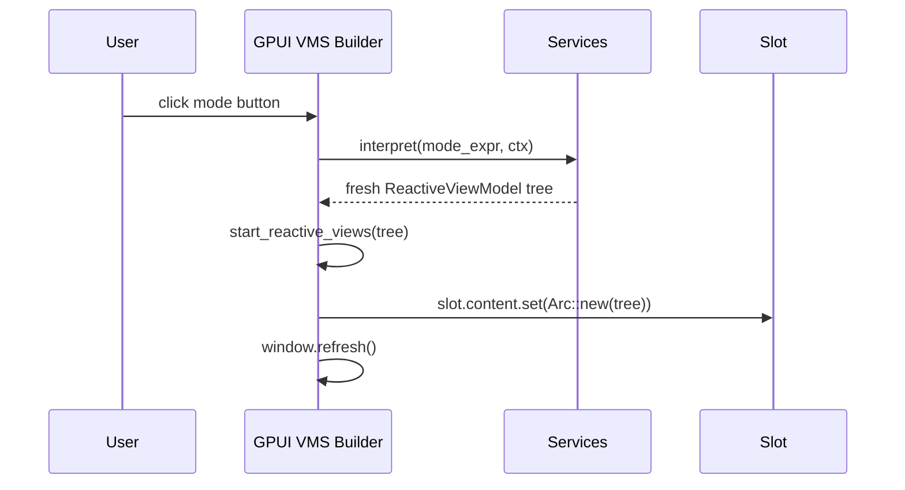
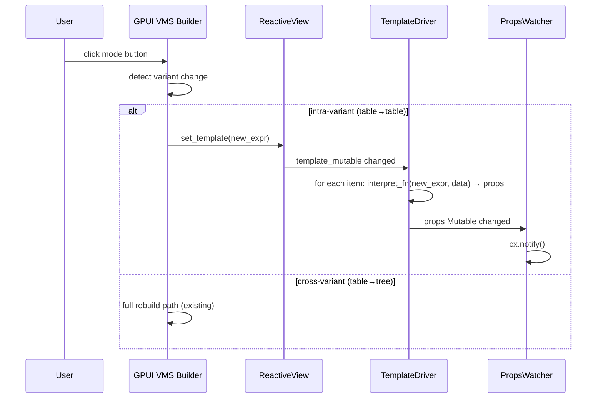

# Design: Reactive ViewModel Refactor — Downstream Simplifications

## Overview

Complete the persistent-node refactor across 5 epics: (1) wire `set_template()` into GPUI's view_mode_switcher for intra-variant switches, (2) add a `resolve_props` fast path for ~15 eligible leaf/element builders, (3) refactor `widget_builder!` macro to generate separate `InterpretFn` and structural builder, (4) remove redundant engine caches (`expand_state_cache`, `view_mode_cache`), and (6) cleanups. Each epic is independently shippable with test gates.

## Architecture

```mermaid
graph TB
    subgraph Before["Current: Full Rebuild on Mode Switch"]
        Click1[GPUI click] --> Interpret1[services.interpret]
        Interpret1 --> StartRV[start_reactive_views]
        StartRV --> SlotSet[slot.set new tree]
    end

    subgraph After["Target: set_template Fast Path"]
        Click2[GPUI click] --> Classify{same variant?}
        Classify -->|intra| SetTemplate[reactive_view.set_template]
        SetTemplate --> TemplateDriver[template_driver re-interprets props]
        Classify -->|cross| FullRebuild[full rebuild path]
    end

    subgraph PropsFastPath["Props-Only Fast Path"]
        DataChange[data arrives] --> InterpretFn[node.interpret_fn]
        InterpretFn --> PropsSet[node.props.set]
        PropsSet --> GpuiNotify[cx.notify via props_watcher]
    end

    subgraph CacheRemoval["Node-Owned State"]
        ExpandToggle[expand_toggle builder] --> NodeExpanded[node.expanded Mutable]
        VMS[view_mode_switcher] --> NodeActiveMode[node prop: active_mode]
    end
```



## Resolved Questions

### Q1: How does GPUI click handler get ReactiveView reference?

**Decision: Capture `Arc<ReactiveView>` in the click closure.**

The view_mode_switcher GPUI builder already captures `slot_handle`, `services`, etc. in its click closure. Adding one more captured value (`Arc<ReactiveView>`) is the simplest approach. This avoids adding a field to `ReactiveViewModel` (which would bloat all nodes) and avoids threading it through `GpuiRenderContext` (which would require plumbing through the render tree).

The `Arc<ReactiveView>` is accessible from the node's `collection` field on the **parent** of the view_mode_switcher — but the VMS builder itself doesn't have easy access to the parent. Instead, the GPUI builder should read the `ReactiveView` from the slot's content node, since the VMS creates its content as a slot whose content was interpreted from a collection widget.

**Concrete approach**: The view_mode_switcher shadow builder stores the `Arc<ReactiveView>` from the slot's initial interpretation (when the slot content is a collection widget) as a field on the slot. The GPUI builder reads it from the slot.

Actually, simplest: the GPUI view_mode_switcher builder walks the slot content's `collection` field to find the `ReactiveView`. If found, it uses `set_template()`. If not found (slot content has no collection), it falls back to full rebuild.

### Q2: Does `ui_state()` still need `is_expanded` after cache removal?

**Decision: No.** `ui_state()` feeds `is_expanded` into `RenderContext` which feeds `Predicate::evaluate()` for profile variant selection. But the expand_toggle shadow builder reads expand state directly via `services.get_or_create_expand_state()` — it doesn't read `is_expanded` from the RenderContext. After removal, the expand_toggle builder reads from the node's own `expanded: Mutable<bool>`, and `ui_state()` no longer needs the `is_expanded` entry.

Grep confirms: `is_expanded` in `ui_state()` is only used by expand_state predicates on entity profiles. These predicates are evaluated during `pick_active_variant` — but expand_toggle doesn't rely on profile variants. The `is_expanded` predicate is unused in production profiles. Safe to remove.

### Q3: Where does generated InterpretFn live?

**Decision: Static function on the shadow builder module.** Each `widget_builder!` invocation generates a `pub fn interpret_fn_closure(...)` alongside `build()`. The collection driver calls it at node-creation time. This is simpler than a registry — no lookup, no dynamic dispatch beyond the existing `Arc<dyn Fn>`.

## Components

### Epic 6: Cleanups (implement first)

#### 6.1: Remove NEXT_VIEW_ID

| File | Action | Change |
|------|--------|--------|
| `crates/holon-frontend/src/reactive_view.rs:157` | Delete | Remove `static NEXT_VIEW_ID` line |

#### 6.2: subscribe_props_signals incremental watcher

**Current**: `subscribe_props_signals` clears ALL watchers on every `VecDiff::Replace`, and does nothing for `InsertAt`/`Push`. New items get no props watcher until the next `Replace`.

**Target**: Add per-item watchers on `InsertAt`/`Push`. Let stale watchers self-terminate (the `this.update()` returns `Err` when the entity is dropped, breaking the loop). `Replace` still clears and re-subscribes all.

```rust
// In ReactiveShell::apply_diff
VecDiff::InsertAt { index, value } => {
    self.items.insert(index, value.clone());
    self.list_state.splice(index..index, 1);
    // Add a single props watcher for the new item
    self.subscribe_single_props_signal(&value, cx);
    self.reconcile_render_blocks(cx);
    cx.notify();
}
VecDiff::Push { value } => {
    let index = self.items.len();
    self.items.push(value.clone());
    self.list_state.splice(index..index, 1);
    self.subscribe_single_props_signal(&value, cx);
    self.reconcile_render_blocks(cx);
    cx.notify();
}
// RemoveAt/Pop: no explicit watcher cancellation needed — stale watcher breaks naturally
```

New helper method:
```rust
fn subscribe_single_props_signal(
    &mut self,
    item: &Arc<ReactiveViewModel>,
    cx: &mut Context<Self>,
) {
    let props_signal = item.props.signal_cloned();
    let task = cx.spawn(async move |this, cx| {
        use futures::StreamExt;
        use futures_signals::signal::SignalExt;
        let mut stream = props_signal.to_stream();
        stream.next().await; // skip initial
        while stream.next().await.is_some() {
            match this.update(cx, |_, cx| cx.notify()) {
                Ok(_) => {}
                Err(_) => break,
            }
        }
    });
    self.props_watchers.push(task);
}
```

#### 6.3: Rename update_from to patch_mutables

| File | Action | Change |
|------|--------|--------|
| `crates/holon-frontend/src/reactive_view_model.rs` | Rename | `update_from` → `patch_mutables` |
| All call sites in `reactive_view_model.rs` | Update | `push_down_children`, `apply_update`, `with_update` |

---

### Epic 1: Wire set_template into View Mode Switcher

#### Data flow: Before



#### Data flow: After



#### Variant detection logic

```rust
fn is_intra_variant_switch(
    current_template_key: &str,
    target_template_key: &str,
    mode_templates: &HashMap<String, RenderExpr>,
) -> bool {
    let current_variant = mode_templates.get(current_template_key)
        .map(collection_variant_of);
    let target_variant = mode_templates.get(target_template_key)
        .map(collection_variant_of);
    current_variant == target_variant
}

fn collection_variant_of(expr: &RenderExpr) -> Option<CollectionVariant> {
    match expr {
        RenderExpr::FunctionCall { name, args, .. } => match name.as_str() {
            "table" => Some(CollectionVariant::Table),
            "tree" => Some(CollectionVariant::Tree),
            "outline" => Some(CollectionVariant::Outline),
            "list" => {
                let gap = extract_gap_arg(args).unwrap_or(0.0);
                Some(CollectionVariant::List { gap })
            }
            "columns" => {
                let gap = extract_gap_arg(args).unwrap_or(0.0);
                Some(CollectionVariant::Columns { gap })
            }
            _ => None,
        },
        _ => None,
    }
}

fn variants_match(a: Option<CollectionVariant>, b: Option<CollectionVariant>) -> bool {
    match (a, b) {
        (Some(CollectionVariant::Table), Some(CollectionVariant::Table)) => true,
        (Some(CollectionVariant::Tree), Some(CollectionVariant::Tree)) => true,
        (Some(CollectionVariant::Outline), Some(CollectionVariant::Outline)) => true,
        (Some(CollectionVariant::List { .. }), Some(CollectionVariant::List { .. })) => true,
        (Some(CollectionVariant::Columns { .. }), Some(CollectionVariant::Columns { .. })) => true,
        _ => false,
    }
}
```

#### GPUI view_mode_switcher changes

The click handler changes from the current 7-step process to:

```rust
.on_mouse_down(gpui::MouseButton::Left, move |_, window, _| {
    active_mode_handle.set(mode_for_click.clone());
    services.set_view_mode(&click_key, mode_for_click.clone());
    let template_key = format!("mode_{}", mode_for_click);

    if let Some(new_expr) = mode_templates_clone.get(&template_key) {
        // Extract ReactiveView + variant info while holding ReadGuard,
        // then drop guard before any write path to avoid deadlock.
        let fast_path = {
            let slot_content = slot_handle.lock_ref();
            slot_content.collection.as_ref().and_then(|rv| {
                let current_layout = rv.layout();
                let target_layout = collection_variant_of(new_expr);
                if variants_match(current_layout, target_layout) {
                    Some(rv.clone()) // clone Arc<ReactiveView>
                } else {
                    None
                }
            })
            // ReadGuard dropped here at end of block
        };

        if let Some(rv) = fast_path {
            // Fast path: set_template on existing ReactiveView
            rv.set_template(new_expr.clone());
            window.refresh();
            return;
        }

        // Fallback: full rebuild (cross-variant or no collection)
        if let Some(ref ctx) = captured_ctx {
            let content = services.interpret(new_expr, ctx);
            let rt = services.runtime_handle();
            let svc_arc: Arc<dyn BuilderServices> = services.clone();
            start_reactive_views(&content, &svc_arc, &rt);
            slot_handle.set(Arc::new(content));
        }
    }
    window.refresh();
});
```

**Key insight**: The `slot_handle` is `Mutable<Arc<ReactiveViewModel>>`. Its locked ref gives the current content node. That node's `collection` field holds the `Arc<ReactiveView>`. We extract the `Arc<ReactiveView>` and compare the target expression's `CollectionVariant` against the current one via `variants_match()`. If same variant → `set_template`. If different → full rebuild. The `ReadGuard` is dropped in a scoped block before any write path to avoid deadlock.

The `item_template` to pass to `set_template` is NOT the mode_template itself (which is e.g. `table(#{item_template: ...})`), but the item_template extracted FROM it. We need a helper:

```rust
fn extract_item_template(collection_expr: &RenderExpr) -> Option<&RenderExpr> {
    match collection_expr {
        RenderExpr::FunctionCall { args, .. } => {
            // Look for item_template or item named arg in args
            args.iter().find_map(|arg| match arg {
                RenderExpr::NamedArg { name, value } if name == "item_template" || name == "item" =>
                    Some(value.as_ref()),
                _ => None,
            })
        }
        _ => None,
    }
}
```

| File | Action | Change |
|------|--------|--------|
| `frontends/gpui/src/render/builders/view_mode_switcher.rs` | Modify | Rewrite click handler with variant detection + set_template |
| `crates/holon-frontend/src/reactive_view.rs` | No change | `set_template()` already exists |

---

### Epic 2: Lightweight resolve_props_only

#### resolve_props function

```rust
// In crates/holon-frontend/src/render_interpreter.rs (or a new props_resolver.rs)

/// Fast-path props extraction: runs only arg-resolution from the widget_builder,
/// skipping child/slot/collection creation.
///
/// Returns the same HashMap<String, Value> that the full `interpret()` would
/// produce for the node's props. Used by InterpretFn closures in collection
/// drivers to avoid the overhead of creating a throwaway ReactiveViewModel.
pub fn resolve_props(
    widget_name: &str,
    expr: &RenderExpr,
    data: &Arc<DataRow>,
    services: &dyn BuilderServices,
    space: Option<AvailableSpace>,
) -> HashMap<String, Value> {
    // Build a minimal RenderContext with the data row
    let ctx = row_render_context(data.clone(), services, space);
    // Resolve args from the expression
    let args = resolve_args(expr, &ctx);
    // Call the widget's props-only extraction
    match PROPS_REGISTRY.get(widget_name) {
        Some(extract_fn) => extract_fn(&args),
        None => {
            // Fallback: full interpret, extract props
            let vm = services.interpret(expr, &ctx);
            vm.props.get_cloned()
        }
    }
}
```

#### Builder classification

Rather than a global registry, use the existing `WidgetMeta.category` from the macro. The `InterpretFn` closure decides at node-creation time:

```rust
// In flat driver / tree driver node creation
let node_interpret_fn: InterpretFn = if is_props_only_widget(&tmpl) {
    // Fast path: just resolve args → props
    let svc = services.clone();
    let space = space_handle.clone();
    Arc::new(move |expr, data| {
        resolve_props(widget_name, expr, data, svc.as_ref(), space.get_cloned())
    })
} else {
    // Full path: create throwaway VM, extract props
    let svc = services.clone();
    let space = space_handle.clone();
    Arc::new(move |expr, data| {
        let ctx = row_render_context(data.clone(), svc.as_ref(), space.get_cloned());
        let fresh = svc.interpret(expr, &ctx);
        fresh.props.get_cloned()
    })
};
```

Classification:

| Category | Builders | props_only? |
|----------|----------|-------------|
| Leaf (auto-body) | text, badge, icon, checkbox | Yes |
| Leaf (raw, props-only) | spacer, editable_text, state_toggle, source_block, source_editor, block_operations, op_button, table_row, pref_field | Yes |
| Layout containers | row, column, section, card, collapsible, chat_bubble, bottom_dock | No (children) |
| Wrappers | focusable, selectable, draggable, pie_menu | No (child) |
| Collections | list, tree, table, columns, outline, query_result | No (ReactiveView) |
| Side-effect | expand_toggle, block_ref, live_query, view_mode_switcher, render_block, drawer | No (slot/cache/watch) |
| Conditional | if_col, if_space | No (conditional logic) |
| Other | error, loading, drop_zone, transclude, render_entity | No |

~13 builders are props_only eligible.

#### How the macro generates it

The `widget_builder!` macro already generates `generate_extraction` code. For auto-body widgets, the extraction + auto_body together ARE the props resolution. We extract this into a separate function:

```rust
// Generated by widget_builder! for `fn text(content: String, bold: bool, size: f32, color: Option<String>);`
pub fn resolve_props_from_args(args: &BuilderArgs<'_, ReactiveViewModel>) -> HashMap<String, Value> {
    let content = args.get_positional_string(0)
        .or_else(|| args.get_string("content").map(|s| s.to_string()))
        .unwrap_or_else(|| "".to_string());
    let bold = args.get_bool("bold").unwrap_or(false);
    let size = args.get_positional_f64(2)
        .or(args.get_f64("size"))
        .map(|v| v as f32)
        .unwrap_or(14.0);
    let color: Option<String> = args.get_positional_string(3)
        .or_else(|| args.get_string("color").map(|s| s.to_string()));

    let mut __props = HashMap::new();
    __props.insert("content".to_string(), Value::String(content));
    __props.insert("bold".to_string(), Value::Boolean(bold));
    __props.insert("size".to_string(), Value::Float(size as f64));
    if let Some(c) = color {
        __props.insert("color".to_string(), Value::String(c));
    }
    __props
}
```

| File | Action | Change |
|------|--------|--------|
| `crates/holon-macros/src/widget_builder.rs` | Modify | Generate `resolve_props_from_args` for non-Collection/Expr params |
| `crates/holon-frontend/src/reactive_view.rs` | Modify | Use classify to pick fast vs full InterpretFn |
| `crates/holon-frontend/src/shadow_builders/mod.rs` | Modify | Export `resolve_props_from_args` for each module |

---

### Epic 3: Eliminate Shadow Builders (Macro Refactor)

#### Macro output: two functions per builder

For auto-body widgets (leaf), the macro generates:

```rust
// text.rs — generated output
pub const WIDGET_META: WidgetMeta = WidgetMeta { ... };

/// Props-only extraction — used by InterpretFn closures in collection drivers.
pub fn resolve_props_from_args(ba: &BA<'_>) -> HashMap<String, Value> {
    // extraction code (same as today)
    let content = ba.args.get_positional_string(0)...;
    let bold = ba.args.get_bool("bold")...;
    // ...
    let mut __props = HashMap::new();
    __props.insert("content".to_string(), Value::String(content));
    // ...
    __props
}

/// Full builder — creates the ReactiveViewModel node.
pub fn build(ba: BA<'_>) -> ViewModel {
    let __props = resolve_props_from_args(&ba);
    ViewModel::from_widget("text", __props)
}
```

For leaf widgets, `build` becomes a trivial wrapper around `resolve_props_from_args` + `ViewModel::from_widget`. No manual shadow builder code at all.

For custom-body widgets (containers), only the props portion is extracted:

```rust
// row.rs — generated output (body provided by user)
pub fn resolve_props_from_args(ba: &BA<'_>) -> HashMap<String, Value> {
    let gap = ba.args.get_positional_f64(0)...;
    let mut __props = HashMap::new();
    __props.insert("gap".to_string(), Value::Float(gap as f64));
    __props
}

pub fn build(ba: BA<'_>) -> ViewModel {
    let gap = ba.args.get_positional_f64(0)...;
    let children: CollectionData = { /* collection extraction */ };
    // user body:
    let mut __props = std::collections::HashMap::new();
    __props.insert("gap".to_string(), Value::Float(gap as f64));
    ViewModel {
        children: children.into_static_items().into_iter().map(Arc::new).collect(),
        ..ViewModel::from_widget("row", __props)
    }
}
```

For raw builders (block_ref, expand_toggle, view_mode_switcher), no `resolve_props_from_args` is generated — they're not props_only eligible.

#### Macro changes summary

| Current | New |
|---------|-----|
| Auto-body: generates `build` with extraction + props-insertion | Auto-body: generates `resolve_props_from_args` + trivial `build` wrapper |
| Custom-body: generates extraction, user provides body | Custom-body: generates `resolve_props_from_args` for non-Collection/Expr params, user body in `build` |
| Raw: generates `WIDGET_META` + renames fn to `build` | Raw: unchanged (no `resolve_props_from_args`) |

| File | Action | Change |
|------|--------|--------|
| `crates/holon-macros/src/widget_builder.rs` | Modify | `generate_auto_body` emits `resolve_props_from_args` + wrapper; `generate_extraction` splits props from structural |
| Leaf shadow builders (text, badge, icon, checkbox) | No change needed | Macro output changes automatically |
| spacer.rs | Simplify | Convert from `raw` to auto-body if possible, or add `resolve_props_from_args` manually |

---

### Epic 4: Remove Engine Caches

#### 4.1: Remove expand_state_cache

**Current flow**:
1. `expand_toggle` shadow builder calls `services.get_or_create_expand_state(target_id)` → gets `Mutable<bool>` from `ReactiveEngine.expand_state_cache`
2. Stores it in `node.expanded`
3. `ui_state()` reads `expand_state_cache` to add `is_expanded` to RenderContext
4. On structural rebuild, `push_down_children` preserves old node's `expanded` handle

**After removal**:
1. `expand_toggle` shadow builder creates `Mutable::new(false)` directly on the node
2. `push_down_children` preserves the `expanded` handle (already does this)
3. `ui_state()` no longer adds `is_expanded` (no consumers)
4. `BuilderServices::get_or_create_expand_state` removed from trait

**Cross-position state sharing**: If the same entity appears in two tree locations, they will have independent expand states. This is acceptable per requirements (cross-position sharing is rare; accepting state loss on reparent).

```rust
// expand_toggle.rs — after cache removal
let expanded = match ba.ctx.expanded_handle() {
    // If parent pushed down an existing Mutable, reuse it
    Some(handle) => handle,
    // Otherwise create fresh
    None => Mutable::new(false),
};
```

Wait — the expand_toggle doesn't get a pre-existing handle from context. It gets it from the cache. After removal, the node creates a fresh `Mutable<bool>` on first interpretation. On re-interpretation (structural change), `push_down_children` reuses the old node's `expanded` handle if widget names match. This is already how it works — the cache was just a safety net for cross-rebuild identity. With persistent nodes, the identity is maintained by `push_down_children`.

**Concrete change**: `expand_toggle` builder creates `Mutable::new(false)` instead of calling `services.get_or_create_expand_state()`.

| File | Action | Change |
|------|--------|--------|
| `crates/holon-frontend/src/reactive.rs` | Delete | Remove `expand_state_cache` field, `get_or_create_expand_state()` impl |
| `crates/holon-frontend/src/reactive.rs` | Delete | Remove `is_expanded` from `ui_state()` |
| `crates/holon-frontend/src/reactive.rs` trait | Delete | Remove `get_or_create_expand_state()` from `BuilderServices` trait |
| `crates/holon-frontend/src/shadow_builders/expand_toggle.rs` | Modify | `Mutable::new(false)` instead of `services.get_or_create_expand_state()` |

#### 4.2: Remove view_mode_cache

**Current flow**:
1. `view_mode_switcher` shadow builder calls `services.get_or_create_view_mode(entity_key, default)` → gets `Mutable<String>` from cache
2. Reads `active_mode.get_cloned()` to pick which mode template to interpret
3. `ui_state()` reads cache to add `view_mode` to RenderContext
4. GPUI click handler calls `services.set_view_mode()` to update cache

**After removal**:
1. `view_mode_switcher` creates active_mode as a prop string (already does `__props.insert("active_mode", ...)`)
2. On re-interpretation, mode is read from the node's props (preserved by `push_down_children`)
3. `ui_state()` no longer adds `view_mode`
4. GPUI click handler updates mode via `set_template()` (Epic 1) or slot replacement — no cache needed

The key insight: with Epic 1's `set_template()`, the active mode is encoded in the template expression itself. There's no need for a separate cache to track "which mode is active" — the ReactiveView's `template_mutable` IS the active mode.

For the shadow builder, the default mode selection on first interpretation uses the first mode from the JSON array (already the case). On re-interpretation after structural change, the slot content's ReactiveView preserves the template (via `push_down_slot`).

| File | Action | Change |
|------|--------|--------|
| `crates/holon-frontend/src/reactive.rs` | Delete | Remove `view_mode_cache` field, `get_or_create_view_mode()`, `set_view_mode()` |
| `crates/holon-frontend/src/reactive.rs` | Delete | Remove `view_mode` from `ui_state()` |
| `crates/holon-frontend/src/reactive.rs` trait | Delete | Remove `get_or_create_view_mode()`, `set_view_mode()` from trait |
| `crates/holon-frontend/src/shadow_builders/view_mode_switcher.rs` | Modify | Use default mode directly, remove `get_or_create_view_mode` call |
| `frontends/gpui/src/render/builders/view_mode_switcher.rs` | Modify | Remove `services.set_view_mode()` call |

---

## Technical Decisions

| Decision | Options | Choice | Rationale |
|----------|---------|--------|-----------|
| ReactiveView access in VMS click | (a) node field, (b) render context, (c) closure capture, (d) walk slot | (d) Walk slot.collection | Zero new fields, works with existing node structure |
| InterpretFn location | (a) registry lookup, (b) static fn on module | (b) Static fn | No dynamic dispatch overhead, simpler |
| Builder classification mechanism | (a) const on module, (b) WidgetMeta.category, (c) explicit list | (c) Explicit fn | Most reliable — category doesn't capture all edge cases (e.g. spacer is "Leaf" but has LayoutHint side effect) |
| Expand state after cache removal | (a) node creates fresh, (b) thread through context | (a) Fresh Mutable | push_down_children preserves identity; no threading needed |
| view_mode after cache removal | (a) node prop, (b) template_mutable IS the mode | (b) Template encodes mode | With set_template(), active mode = current template expression |
| Props-only classification for spacer | (a) props_only, (b) full | (a) props_only | LayoutHint::Fixed is set from props, not a side effect — it's consumed by the parent container |

## File Structure

| File | Action | Purpose |
|------|--------|---------|
| `crates/holon-frontend/src/reactive_view.rs` | Modify | Remove NEXT_VIEW_ID; modify flat driver InterpretFn creation |
| `crates/holon-frontend/src/reactive_view_model.rs` | Modify | Rename update_from → patch_mutables |
| `crates/holon-frontend/src/reactive.rs` | Modify | Remove expand_state_cache, view_mode_cache, trait methods |
| `crates/holon-frontend/src/shadow_builders/expand_toggle.rs` | Modify | Use node-owned Mutable instead of cache |
| `crates/holon-frontend/src/shadow_builders/view_mode_switcher.rs` | Modify | Remove cache dependency |
| `crates/holon-macros/src/widget_builder.rs` | Modify | Generate resolve_props_from_args |
| `frontends/gpui/src/render/builders/view_mode_switcher.rs` | Modify | Variant detection + set_template fast path |
| `frontends/gpui/src/views/reactive_shell.rs` | Modify | Incremental subscribe_props_signals |

## Error Handling

| Error Scenario | Handling Strategy | User Impact |
|----------------|-------------------|-------------|
| set_template on non-Collection variant | `tracing::warn` (already implemented) | No-op, user sees stale content |
| Cross-variant switch misclassified as intra | Prevented by `collection_variant_of` checking function name | Would see wrong layout; prevented |
| props_only builder called for full-interpret widget | Fallback to full interpret path | Slightly slower, correct output |
| Expand state lost on reparent | Accepted tradeoff | Expand collapses; user re-clicks |

## Edge Cases

- **Same entity in two tree positions**: After cache removal, each position has independent expand/mode state. Acceptable per requirements.
- **view_mode_switcher with no collection in slot**: Some mode templates might produce a non-collection widget (e.g. a static column). The GPUI builder falls back to full rebuild when `slot_content.collection` is `None`.
- **spacer with LayoutHint**: spacer sets `LayoutHint::Fixed` on the node. This is read by the parent container at build time, not reactively. Props-only classification is correct — the InterpretFn updates props, and the parent's structural rebuild picks up the new LayoutHint.
- **Empty collection + set_template**: If the collection has 0 items, `set_template` still updates `template_mutable`. When items arrive later, they'll use the new template. Correct.

## Test Strategy

### Unit Tests
- No new tests — existing tests cover all scenarios

### Integration Tests
- `layout_proptest::layout_invariants_hold_for_random_scenarios` — mode switches, entity cache preservation
- `layout_proptest::block_ref_inside_tree_item_has_nonzero_height` — expand state
- `layout_proptest::streaming_collection_data_arrival` — props watchers, InterpretFn

### E2E Tests
- `general_e2e_pbt` (Full, SqlOnly, CrossExecutor) — overall correctness after each epic

### Test commands
```bash
# After each epic:
cargo nextest run -p holon-frontend 2>&1 | tee /tmp/frontend-tests.log
cargo nextest run -p holon-gpui --test layout_proptest 2>&1 | tee /tmp/layout-proptest.log
cargo nextest run -p holon-integration-tests --test general_e2e_pbt 2>&1 | tee /tmp/e2e-pbt.log
```

## Existing Patterns to Follow

- `widget_builder!` macro: three modes (auto-body, custom-body, raw) — extend, don't replace
- `Mutable<T>` + `signal_cloned()` for reactive state
- `Arc<dyn Fn(...)>` for stored closures (InterpretFn pattern)
- `push_down_children` positional matching for node identity preservation
- `stable_cache_key` hashing for GPUI entity cache hits

## Implementation Steps

1. **Epic 6.1**: Delete `NEXT_VIEW_ID` static (1 line)
2. **Epic 6.3**: Rename `update_from` → `patch_mutables` (method + all call sites)
3. **Epic 6.2**: Add `subscribe_single_props_signal` helper; wire into `InsertAt`/`Push` in `apply_diff`
4. **Checkpoint**: Run all tests
5. **Epic 1**: Modify GPUI `view_mode_switcher.rs` click handler — add variant detection, walk slot for ReactiveView, call `set_template()` for intra-variant
6. **Checkpoint**: Run all tests (especially layout_proptest mode switch scenarios)
7. **Epic 2**: Add `resolve_props_from_args` generation to `widget_builder!` macro; wire into flat/tree driver InterpretFn creation with `is_props_only_widget` classification
8. **Epic 3**: Refactor macro's `generate_auto_body` to emit `resolve_props_from_args` + trivial `build` wrapper; verify leaf builders produce identical props
9. **Checkpoint**: Run all tests
10. **Epic 4.1**: Remove `expand_state_cache` from `ReactiveEngine`; modify `expand_toggle` builder; remove `is_expanded` from `ui_state()`; remove `get_or_create_expand_state` from trait
11. **Epic 4.2**: Remove `view_mode_cache` from `ReactiveEngine`; simplify `view_mode_switcher` builder; remove `set_view_mode` and `get_or_create_view_mode` from trait
12. **Final checkpoint**: Run full test suite across all variants
